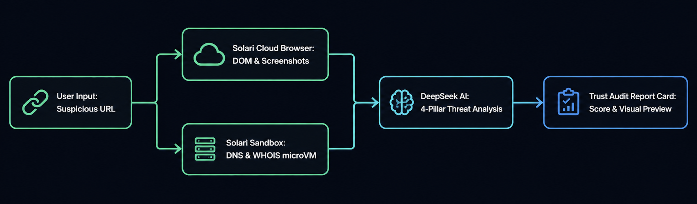

# VerifyLink — Instant Zero-Trust Scam & Link Inspector

VerifyLink is an open-source web application that allows users to submit suspicious URLs, payment links, or online deals. It spins up an ephemeral, isolated **Solari Cloud Browser** and **Solari Sandbox** microVM to inspect the link safely, run heuristic security checks, detect fake checkout gateways and phishing patterns, and generate a publicly shareable, visual Trust Audit Card in seconds.

## Architecture



1. **User Input:** User pastes a link on the Next.js UI or chooses demo scenarios.
2. **Solari Cloud Browser (< 3s):** Connects via Playwright to an isolated cloud browser in stealth mode. Extracts SSL/TLS certificates, server response headers, cross-domain form actions, screenshots, and DOM scripts.
3. **Solari Sandbox (< 1.5s):** Provisions an isolated microVM to run DNS resolution and WHOIS domain age / registrar extraction.
4. **AI Threat Reasoning:** Feeds DOM, exfiltration targets, and network telemetry into LLM threat analysis (DeepSeek / Gemini) across 4 zero-trust security pillars.
5. **Report Generation & Action Plan:** Produces an interactive Trust Score, actionable consumer defense checklist, infrastructure forensics, and 1-click PDF / JSON export tools.

## Performance Benchmark

| Solution | Cold Start Time | Execution Time | Total Latency |
|----------|-----------------|----------------|---------------|
| **VerifyLink (Solari microVMs)** | **~50ms** | **~2.8s** | **< 3s** |
| Traditional Cloud VMs | ~45s | ~3s | ~48s |
| Basic API Scanners (No DOM) | 0ms | ~1s | ~1s (Low accuracy) |

## Running Locally

### Prerequisites

You need a **Solari API Key** and either a **Google Gemini API Key** (Free tier available) OR a **DeepSeek API Key** (or both for automatic failover).
If you don't provide them, the app will automatically run in **Mock Mode** using simulated data for local UI development.

1. Clone the repository and install dependencies:
```bash
npm install
```

2. Set up your environment variables:
Create a `.env` file in the root directory:
```env
# Solari API for Cloud Browser and Sandbox MicroVMs
SOLARI_API_KEY=your_solari_api_key

# AI Threat Analysis Engines (Provide either one or both)
# If both are provided, DeepSeek V4 is used by default with an interactive UI toggle and automatic failover
DEEPSEEK_API_KEY=your_deepseek_api_key # PAID (Default if both added)
GEMINI_API_KEY=your_gemini_api_key    # FREE (20 req/day on Gemini 3.7 Flash)

# PostgreSQL connection string for saving reports (optional)
POSTGRES_URL=your_postgres_connection_string

# App URL for absolute link generation (optional)
NEXT_PUBLIC_APP_URL=http://localhost:3000
```

3. Run the development server:
```bash
npm run dev
```

4. Open [http://localhost:3000](http://localhost:3000) with your browser to see the result.

## Tech Stack
- **Framework:** Next.js 16 (App Router with Turbopack), TypeScript, Tailwind CSS v4, Framer Motion, Lucide Icons
- **Isolation Engines:** `@solarisdk/browser`, `@solarisdk/sandbox`, Playwright v1.62
- **AI Forensics:** DeepSeek V4 (`deepseek-chat`), Google Gemini (`gemini-3.7-flash`, `3.6-flash`, `3.5-flash`), Zod schema validation
- **Persistence:** PostgreSQL (`pg`) with automatic in-memory caching fallback

## Expanding Beyond the Base Version

> **Note on Current Version & Scope:**  
> This current release is a **foundational / base version** showcasing how ephemeral cloud browser microVMs and isolated sandbox environments can be chained with modern LLM reasoning. The core architecture is deliberately built to be modular and can be substantially expanded into a much stronger, enterprise-grade threat detection, active payload detonation, and in-depth forensic testing platform.

The platform is designed to be expanded across several dimensions:

- **Deeper Active Detonation & Multi-Step Testing:** Simulating automated multi-step checkout interactions, testing fake credit card submissions to catch exfiltration webhooks, and interacting with evasive popup overlays.
- **Specialized Threat Model Fine-Tuning:** Training and fine-tuning dedicated classification models on evolving phishing kits, typosquatting domains, and zero-day counterfeit e-commerce clones.
- **Advanced Forensic Telemetry & Network Dumps:** Generating downloadable PCAP network trace logs, full HAR archives, and interactive session replay video recordings directly from the Solari microVM.
- **SSL / TLS Certificate Graph Analysis:** Integrating deeper cryptographic analysis of certificate revocation lists (CRL), intermediate CAs, and ASN reputation clusters.
- **Real-Time Threat Intelligence Feeds:** Ingesting live feeds from decentralized threat registries, antiphishing workgroups, and browser telemetry databases.

## Contributing

Contributions, feature suggestions, and pull requests are warmly welcome! If you want to contribute new threat detection heuristics, improve sandbox commands, or add new forensic pillars:

1. Fork the repository
2. Create your feature branch (`git checkout -b feature/advanced-threat-heuristics`)
3. Commit your changes (`git commit -m 'Add multi-step form detonation logic'`)
4. Push to the branch (`git push origin feature/advanced-threat-heuristics`)
5. Open a **Pull Request**

---

Developed with ❤️ by **[brainstormity](https://x.com/brainstormity)**
